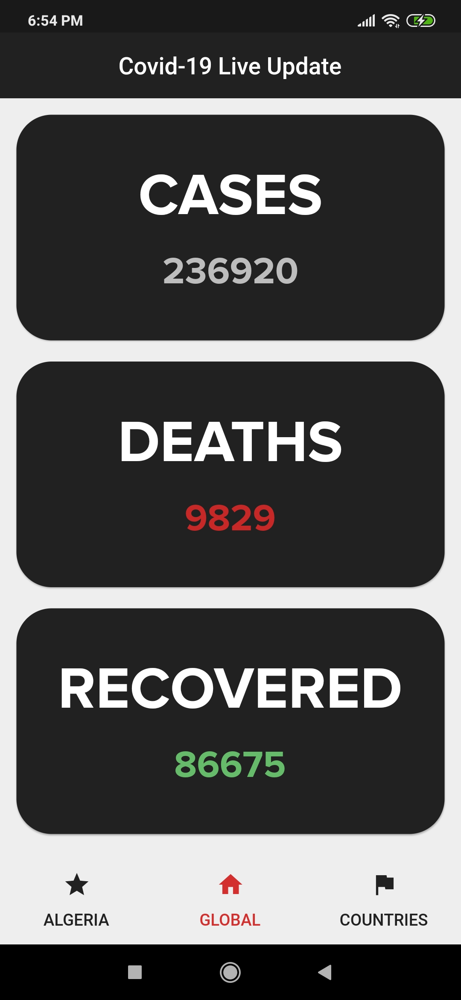
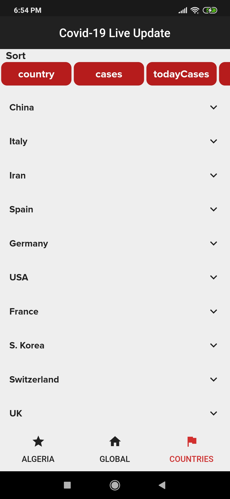

# Coronavirus Live Update
This app shares updates on the Coronavirus (COVID-19)

# Show me some ❤️ and star the repo to support the project.

# Note
- The API endpoints are a fork from [COVID API](https://github.com/NovelCOVID/API)

# Screenshots

<p align="center">


</p>

# Getting started

1. [Setup Flutter](https://flutter.dev/docs/get-started/install)

2. Clone the repo

    ```
    $ git clone https://github.com/lagripe/Covid-19-Live-Update-Flutter
    $ cd Covid-19-Live-Update-Flutter/covid
    ```
3. Run
        `$ flutter run`


